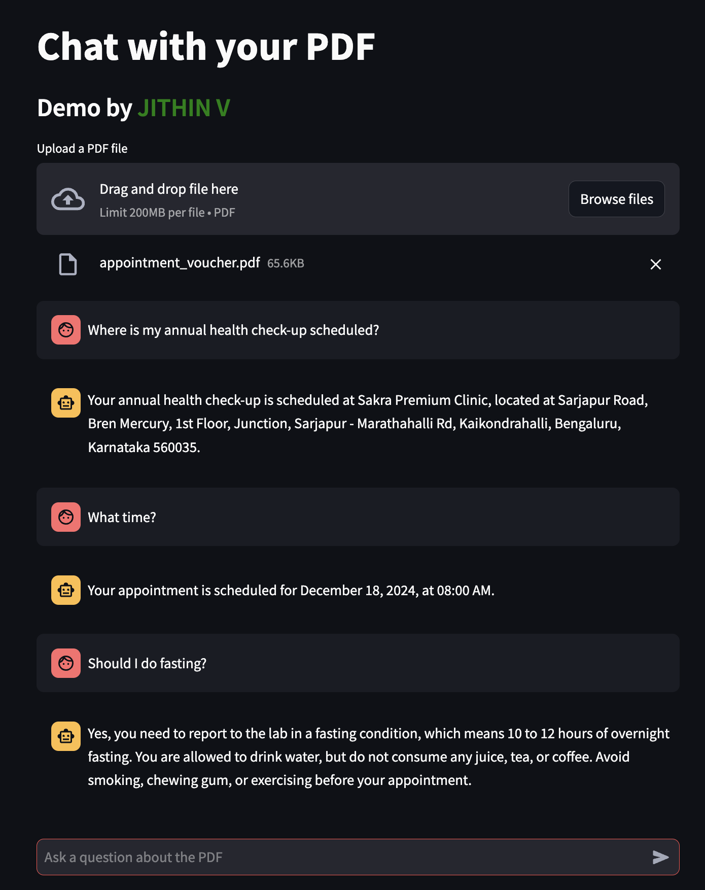

# PDF Chat App

This is a Streamlit-based application that allows users to upload a PDF file and interact with its content through a chat interface. The app uses LangChain and OpenAI's GPT-4o-mini model to process the PDF and answer questions based on its content.

## Access the Application

This app is hosted on HuggingFace Spaces. You can access it [here](https://jithinvijaydazz-pdf-chat.hf.space/).

## Screenshot


## Features

- **Upload PDF**: Users can upload a PDF file (up to 2 MB).
- **Chat Interface**: Users can ask questions about the PDF content and receive concise answers.
- **Conversation History**: The chat maintains a history of the conversation for context.

## Directory Structure

```
chat-with-pdf-app-demo/
├── app.py
├── components/
│   ├── chat.py
│   ├── pdf_processing.py
│   └── ui.py
├── utils/
│   └── config.py
├── requirements.txt
└── Dockerfile
```

## Installation

### Using Virtual Environment

1. **Clone the repository**:
    ```bash
    git clone https://github.com/JithinVijayadas/chat-with-pdf-app-demo.git
    cd chat-with-pdf-app-demo
    ```

2. **Create a virtual environment**:
    ```bash
    python -m venv venv
    source venv/bin/activate  # On Windows use `venv\Scripts\activate`
    ```

3. **Install the dependencies**:
    ```bash
    pip install -r requirements.txt
    ```

4. **Set up the OpenAI API key**:
    - Create a `.env` file in the root directory of the project.
    - Add your OpenAI API key to the `.env` file:
      ```
      API_KEY=your_openai_api_key
      ```

5. **Run the Streamlit app**:
    ```bash
    streamlit run app.py
    ```

### Using Docker

1. **Clone the repository**:
    ```bash
    git clone https://github.com/JithinVijayadas/chat-with-pdf-app-demo.git
    cd chat-with-pdf-app-demo
    ```

2. **Build the Docker image**:
    ```bash
    docker build -t pdf_chat_app .
    ```

3. **Run the Docker container**:
    ```bash
    docker run -p 7860:7860 --env API_KEY=your_openai_api_key pdf_chat_app
    ```

## Usage

1. **Upload a PDF file**:
    - Click on the "Upload a PDF file" button and select a PDF file (up to 2 MB).

2. **Ask questions**:
    - Use the chat interface to ask questions about the PDF content.

## Code Overview

### `app.py`

The main entry point of the application. It initializes the Streamlit app, displays the UI, and handles the PDF upload and chat functionality.

### `components/ui.py`

Contains the `display_ui` function which handles the PDF upload UI.

### `components/chat.py`

Contains the `handle_chat` function which manages the chat interface and interaction with the PDF content.

### `components/pdf_processing.py`

Contains the `process_pdf` function which processes the uploaded PDF and creates a retriever for question-answering.

### `utils/config.py`

Contains the `get_api_key` function which retrieves the OpenAI API key from environment variables.

## Dependencies

- `streamlit`
- `langchain`
- `langchain_community`
- `faiss-cpu`
- `langchain_text_splitters`
- `pypdf`
- `openai`
- `tiktoken`
- `python-dotenv`

## Contributing

Contributions are welcome! Please open an issue or submit a pull request for any improvements or bug fixes.

## Acknowledgements

- Streamlit
- LangChain
- OpenAI


